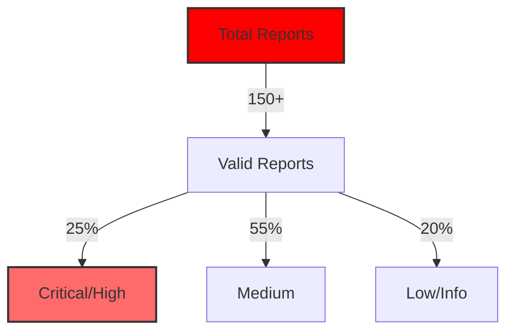

# 🛡️ Bug Hunter | Security Researcher

<div align="center">
  
</div>

<div align="center">
  
  [](https://hackerone.com/rojab)
  [](https://twitter.com/rojab)
  [](https://linkedin.com/in/rojab)
  
</div>

<div align="center">
  
</div>

---

## 🎯 About Me

> 🔍 **Passionate Bug Hunter specializing in critical vulnerabilities that matter**

I'm a security researcher focused on finding high-impact vulnerabilities in web applications. My expertise lies in identifying complex security flaws that often go unnoticed by automated scanners.

- 🎯 **HackerOne Profile**: [@rojab](https://hackerone.com/rojab)
- 🏆 **Achievement**: Invited to **Live Hacking Event (LHE) in Las Vegas**
- 🔐 **Focus Areas**: IDOR, Privilege Escalation, Business Logic Errors, Access Control
- 🌟 **Notable Findings**: Discovered critical vulnerabilities in **TikTok**, **Braze**, and **Front**

## 🛠️ Vulnerability Expertise

<div align="center">

### 🔥 Core Specializations

| Vulnerability Type | Expertise Level | Impact |
|-------------------|-----------------|---------|
| **IDOR (Insecure Direct Object Reference)** | ⭐⭐⭐⭐⭐ | Critical |
| **Privilege Escalation** | ⭐⭐⭐⭐⭐ | Critical |
| **Business Logic Errors** | ⭐⭐⭐⭐⭐ | High-Critical |
| **Improper Access Control** | ⭐⭐⭐⭐⭐ | High-Critical |
| **Authentication Bypass** | ⭐⭐⭐⭐ | Critical |
| **Authorization Flaws** | ⭐⭐⭐⭐ | High |
| **API Security** | ⭐⭐⭐⭐ | High |
| **SSRF** | ⭐⭐⭐ | Medium-High |

</div>

## 🏅 Hall of Fame & Achievements

<div align="center">

### 🎖️ Companies I've Helped Secure

<table>
  <tr>
    <td align="center">
      <br>
      <b>Critical IDOR</b><br>
      <i>Account Takeover</i>
    </td>
    <td align="center">
      <br>
      <b>Privilege Escalation</b><br>
      <i>Admin Access</i>
    </td>
    <td align="center">
      <br>
      <b>Access Control Bypass</b><br>
      <i>Data Exposure</i>
    </td>
  </tr>
</table>

### 🌟 Special Recognition

```
🏆 Live Hacking Event (LHE) - Las Vegas
   └── Exclusive invitation for top security researchers
   └── Real-time vulnerability hunting
   └── Direct collaboration with security teams
```

</div>

## 📊 Bug Hunting Stats

<div align="center">



</div>

## 🔍 Methodology & Tools

### My Approach to Finding Vulnerabilities

```bash
1. Reconnaissance
   └── Subdomain enumeration
   └── API endpoint discovery
   └── Technology stack identification

2. Access Control Testing
   └── IDOR hunting across all endpoints
   └── Horizontal/Vertical privilege testing
   └── JWT/Session manipulation

3. Business Logic Analysis
   └── Workflow bypass attempts
   └── Race condition testing
   └── State manipulation

4. Deep Dive Testing
   └── Parameter pollution
   └── Mass assignment
   └── GraphQL introspection abuse
```

### 🛠️ Favorite Tools


## 📚 Security Research & Write-ups

### 📝 Featured Vulnerability Discoveries

1. **[IDOR to Account Takeover in Major Social Platform]**
   - Impact: Access to millions of user accounts
   - Bounty: $XX,XXX
   - Severity: Critical

2. **[Privilege Escalation via Business Logic Flaw]**
   - Impact: Regular user to admin access
   - Bounty: $X,XXX
   - Severity: Critical

3. **[Access Control Bypass in Enterprise SaaS]**
   - Impact: Unauthorized data access across tenants
   - Bounty: $X,XXX
   - Severity: High

## 🎯 Current Focus

- 🔬 Researching advanced IDOR patterns in modern frameworks
- 📊 Developing automated tools for access control testing
- 🌐 Exploring GraphQL security vulnerabilities
- 🤖 Building custom Nuclei templates for business logic flaws

## 💡 Bug Hunting Tips

> **"The best bugs are found where automation fails - in the business logic"**

### For Aspiring Bug Hunters:
1. **Master the basics** before hunting for complex bugs
2. **Understand the business** logic of your target
3. **Think like a developer** to find developer mistakes
4. **Document everything** - good reports get good bounties
5. **Be persistent** - the best bugs require patience

## 📫 Contact & Collaboration

<div align="center">

**Open for:**
- 🤝 Private bug bounty programs
- 📚 Security training and workshops
- 🔍 Penetration testing projects
- 💬 Security research collaboration

[](mailto:rojab@security.com)

</div>

---

<div align="center">
  
  
  
</div>

<div align="center">
  <i>🛡️ Making the internet safer, one bug at a time</i>
</div>

<!-- Activity Graph -->
<div align="center">
  
</div>

---

<div align="center">
  
</div>
